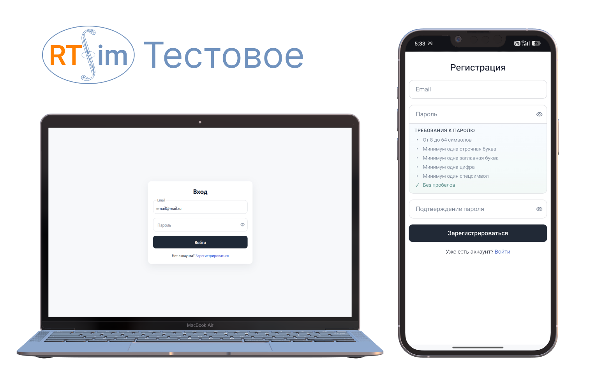

# RTSIM тестовое задание

Демо: https://kosfin.github.io/rtsim-test

Реализация формы авторизации и регистрации (SPA) на связке **React + TypeScript**. Решены все требования задания: переключение режимов, адаптивная вёрстка, валидация и мок-работа с API.

## Реализованный функционал

- Бесшовная навигация (вход -> регистрация -> успех) через `react-router-dom`
- После успешной регистрации пользователя автоматически перенаправляет на вход с сохранением контекста (появляется success-уведомление)
- Корректная семантика для скринридеров (базовая a11y)

## Валидация и обработка ошибок

Проект включает и клиентскую проверку, и симуляцию серверных ответов:

**Клиентская валидация:**

- **Email:** проверка на заполненность, лимит в 254 символа, валидация по регулярному выражению
- **Пароль:** динамический чеклист (8-64 символа, заглавные и строчные буквы, минимум 1 цифра и спецсимвол, отсутствие пробелов)

**Серверные ошибки (Mock):**
Для эмуляции ответов сервера (задержка 1000мс) настроены три сценария:

- **409 Conflict** ("Пользователь с таким email уже существует") - для проверки введите при регистрации любой адрес, оканчивающийся на `@exists.test`
- **403 Forbidden** ("Пользователь заблокирован") - для проверки логина введите email `blocked@rtsim.ru`
- Fallback-сообщение о сетевом сбое, если формат ответа неизвестен
